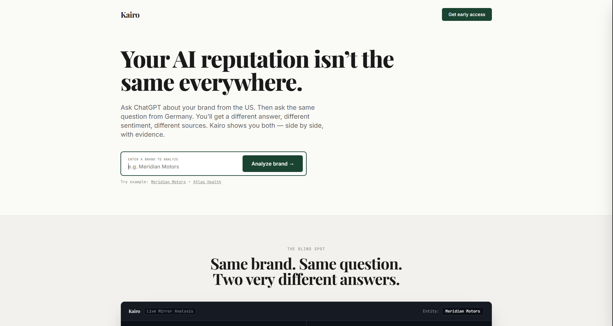
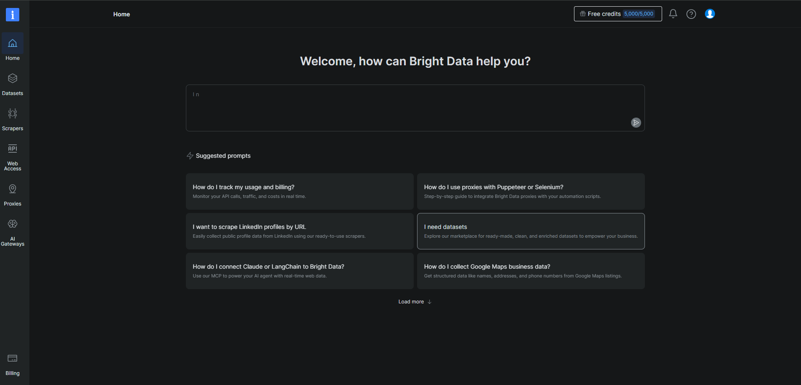
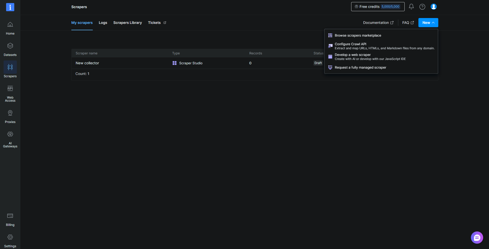
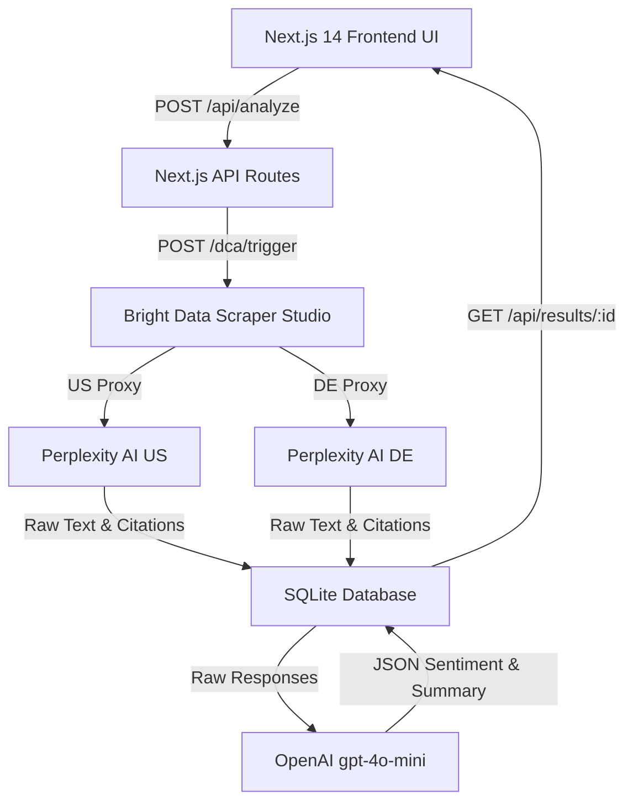

# Kairo — AI Brand Reputation Intelligence

> **See how AI sees your brand — everywhere.**  
> Monitor, compare, and analyze how AI search engines represent your brand across different geographic markets.



---

## What Is Kairo?

AI search engines like Perplexity, ChatGPT, and Gemini don't tell the same story about your brand everywhere. 

Depending on which country a user asks from, an AI model will cite different local publications, assign different sentiment scores, and emphasize different corporate risks or achievements.

**Kairo** reveals this blind spot. It allows marketing directors, brand managers, and PR leads to run parallel, geo-proxy queries against AI models—comparing how your brand is framed in the **United States vs. Germany** side-by-side with hard empirical evidence.

---

## Quick Start

### Requirements
* **Node.js:** `20.14+` (or `>= 18.0.0`)
* **Bright Data Account:** Web Scraper Studio collector & API token
* **OpenAI API Key:** Account access to `gpt-4o-mini`

### Recommended Setup

```bash
git clone https://github.com/Swapnilgupta171/geo-sentinel.git
cd geo-sentinel
npm run setup
npm run dev
```

Then open [http://localhost:3000](http://localhost:3000) in your browser.

> `npm run setup` automatically verifies your environment, installs dependencies, creates `.env.local` safely, prompts for any missing API keys interactively, and runs diagnostic health checks.

---

## See Kairo in Action

### 1. Launch a Brand Analysis
Enter any company or entity name (such as *Tesla* or *Meridian Motors*) directly on the Kairo landing interface to trigger a real-time geographic audit.


* **What you see:** A clean, editorial brand input interface designed for enterprise marketing and PR leads.
* **Why it matters:** Eliminates manual VPN switching or multi-country prompt testing by providing a unified entry point for global reputation intelligence.

---

### 2. Compare AI Reputation Across Geographic Markets
When you launch an analysis, Kairo opens a live side-by-side comparison drawer contrasting the US perspective against the German perspective.


* **What you see:** 
  * **Core Insight**: An automated high-level narrative summary of how the brand is framed differently across borders.
  * **Sentiment Scores**: Quantitative sentiment indicators (`+0.68` US vs. `+0.24` DE) normalized between `-1.0` and `+1.0`.
  * **Visibility Indicators**: Prominently Cited vs. Secondary Mention classification.
  * **Narrative Summaries**: AI-synthesized 1-sentence summaries highlighting regional narrative shifts.
  * **Top Cited Sources**: Exact external publisher URLs cited by the AI search engine in each country.
* **Why it matters:** Brand teams instantly see if an AI model is projecting an optimistic innovation story in North America while highlighting regulatory scrutiny or EU compliance concerns in Europe.

---

## Powered by Geographic Web Scraping

Kairo integrates directly with **Bright Data Web Scraper Studio** to execute headless browser queries across residential proxy networks.

> **Note:** The screenshots below represent the external **Bright Data Web Scraper Studio** configuration portal used to manage target proxies and scraper rules, not Kairo's internal UI.

### 1. Bright Data Control Panel
Kairo triggers automated requests through Bright Data's Web Access infrastructure.



### 2. Web Scraper Studio Collectors
Scraper collectors execute custom Puppeteer interaction scripts (`scraper/interaction.js`) and Cheerio DOM parsers (`scraper/parser.js`) against target AI engines.



### Data Integration Flow
```text
Kairo Web App
     ↓  (POST /api/analyze - batch US & DE query)
Bright Data Scraper Studio
     ↓  (Per-country residential proxy execution)
Perplexity AI Search Engine
     ↓  (Raw answer text & citation links collected)
Kairo Database (SQLite)
     ↓  (OpenAI gpt-4o-mini structured analysis)
Kairo Comparative Drawer UI
```

---

## Product Workflow

```text
1. User enters brand ("Tesla")
         ↓
2. Kairo triggers Bright Data scraper batch (US + DE proxies)
         ↓
3. Raw AI answers & citations collected
         ↓
4. Answers ingested into local SQLite database
         ↓
5. OpenAI (gpt-4o-mini) synthesizes sentiment & narrative deltas
         ↓
6. Kairo drawer renders side-by-side comparison & source citations
```

---

## Technical Architecture



---

## Tech Stack

* **Frontend Framework:** Next.js 14.2.5 (App Router), React 18.3.1, TypeScript 5.5.4
* **Styling & Aesthetics:** Tailwind CSS 3.4.7, PostCSS, Custom Serif Typography (Playfair Display)
* **Backend Runtime:** Next.js Server API Routes (Node.js >= 20.14.0)
* **Database:** SQLite via `better-sqlite3` 11.1.2 (WAL mode, lazy instantiation)
* **Scraper Engine:** Bright Data Web Scraper Studio (Puppeteer interaction & Cheerio parsing)
* **LLM Engine:** OpenAI API (`gpt-4o-mini`, `json_object` format, temperature 0)

---

## Using Kairo with Claude Code or Codex

To set up Kairo using an AI coding agent (Claude Code, OpenAI Codex, Cursor):

1. Clone the repository and open it in your coding workspace.
2. Provide your agent with this prompt:

> "Set up Kairo locally: run `npm run setup` to configure `.env.local` and dependencies, run `npm run doctor` diagnostics, and start the development server."

Refer to [`AGENTS.md`](AGENTS.md) and [`CLAUDE.md`](CLAUDE.md) for full machine-readable contracts and architectural rules.

---

## Environment Variables

Kairo requires three environment variables configured in `.env.local`:

| Variable Name | Required? | Description | Where to Obtain |
|---|---|---|---|
| `BRIGHT_DATA_API_TOKEN` | Yes | API authentication token for triggering scrapers | Bright Data Dashboard -> Account Settings -> API Tokens |
| `BRIGHT_DATA_COLLECTOR_ID` | Yes | Collector ID for the Perplexity Scraper Studio worker | Bright Data -> Web Scraper Studio -> Collector Header (`c_...`) |
| `OPENAI_API_KEY` | Yes | API key for LLM sentiment analysis (`gpt-4o-mini`) | OpenAI Platform -> API Keys (`sk-proj-...`) |

---

## Manual Setup Alternative

If you prefer manual setup step-by-step:

```bash
# 1. Install dependencies
npm install

# 2. Create environment file template
cp .env.example .env.local

# 3. Edit .env.local to fill in API credentials:
# BRIGHT_DATA_API_TOKEN=...
# BRIGHT_DATA_COLLECTOR_ID=...
# OPENAI_API_KEY=...

# 4. Run diagnostic health check
npm run doctor

# 5. Launch development server
npm run dev
```

---

## Security Best Practices

* **Never commit `.env.local`:** `.env.local` is listed in `.gitignore` and must never be committed to Git.
* **No hardcoded secrets:** All API calls consume keys dynamically from `process.env`.
* **Template safe:** Always use `.env.example` as a template for new deployments.

---

## Repository Structure

```text
geo-sentinel/
├── app/          # Next.js App Router pages, components, & API handlers
├── db/           # SQLite database client & schema migrations
├── docs/         # Architecture specs, MVP boundaries, & logic decision logs
├── images/       # Product screenshots & visual documentation assets
├── scraper/      # Bright Data interaction code & parser scripts
├── scripts/      # Setup & doctor CLI scripts (setup.js, doctor.js)
└── shared/       # Shared TypeScript types & interfaces
```

---

## Documentation & Troubleshooting

* **Detailed Installation Guide:** See [`INSTALL.md`](INSTALL.md)
* **Troubleshooting Matrix:** See [`TROUBLESHOOTING.md`](TROUBLESHOOTING.md)
* **System Architecture:** See [`docs/ARCHITECTURE.md`](docs/ARCHITECTURE.md)
* **Agent Guidelines:** See [`AGENTS.md`](AGENTS.md) and [`CLAUDE.md`](CLAUDE.md)

---

## License

Private / Proprietary — Kairo AI Brand Reputation Intelligence.
